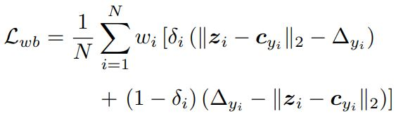

# Weighted-Adaptive-Decision-Boundary


### Introduction
오픈 의도 분류와 관련된 기존 연구인 [적응 결정경계(ADB)](https://github.com/thuiar/Adaptive-Decision-Boundary)가 반경이 큰 결정경계가 학습되는 문제를 해결하기 위해 데이터의 중요도를 고려한 결정경계 학습 방법(Data Weighted Adaptive Decision Boundary)을 제안합니다 (Accepted by KCC2022).
</br>

### Model

</br>

### __중요도를 추가한 손실함수__
 
 

#### 변경 코드

```
d_weight = k/euc_dis
pos_loss = (euc_dis - d) * pos_mask * d_weight
neg_loss = (d - euc_dis) * neg_mask * d_weight
loss = pos_loss.mean() + neg_loss.mean()
```


###  Results

#### Overall Performance

| | | BANKING     |  | OOS      |  |  StackOverflow     |  |  
|:-----:|:-----:|:-----:|:-----:|:-----:|:-----:|:-----:|:-----:|
| KIR* | Methods | Accuracy | F1-score | Accuracy  |F1-score  | Accuracy | F1-score | 
|25%| ADB      |76.43| 70.9857 |88.18  | 77.1444 | 89.73 | 83.2968 | 
|| Proposed Method     | __77.92__ | __71.6319__ | __88.63__ | __77.6504__ | __90.10__ |__83.5063__|
|50%|  ADB  | 79.38 | 81.0024 | 86.72 | 85.1147 | __88.97__ | __87.9562__ | 
|| Proposed Method | __80.10__ | __81.2485__ | __87.26__ | __85.4592__ | 88.90 | 87.8335 |
|75% | ADB | 81.98 | 86.8214 | 86.61 | __88.6013__ | __84.80__ | __87.7931__ |
|| Proposed Method  |  __82.14__ | __86.8577__ | __86.74__ | 88.5513 | 84.58 | 87.5654 | 

*KIR 은 "Known Intent Ratio" 를 의미합니다.

#### Fine-grained Performance

|  | | BANKING     |  | OOS      |  |  StackOverflow     |  |  
|:-----:|:-----:|:-----:|:-----:|:-----:|:-----:|:-----:|:-----:|
| KIR | Methods | Open | Known | Open | Known | Open | Known | 
|25%| ADB      |82.9256|  70.3572 |92.3680  | 76.7438 | 93.0754 | 81.3411 | 
|| Proposed Method     | __84.2464__ | __70.9680__ | __ 92.6980__ | __ 77.2544__ | __93.3633__ |__ 81.5349__|
|50%|  ADB  |  79.4754 | 81.0426 | 88.8450 | 85.0649  | __89.9379__ | __87.7580__ | 
|| Proposed Method | __80.5023__ | __81.2682__ | __89.3951__ | __85.4067__ | 89.8918 | 87.6277 |
|75% | ADB |  67.7220 | 87.1507 | 84.4884 | __88.6381__ | __76.3578__ | __88.5555__ |
|| Proposed Method  |  __68.4246__ | __87.1755__ | __84.7258__ | 88.5854 | 76.2582 |  88.3192| 

“Open” 과 “Known” 은 open class와 known class에 대한 macro f1-score 를 나타냅니다.
